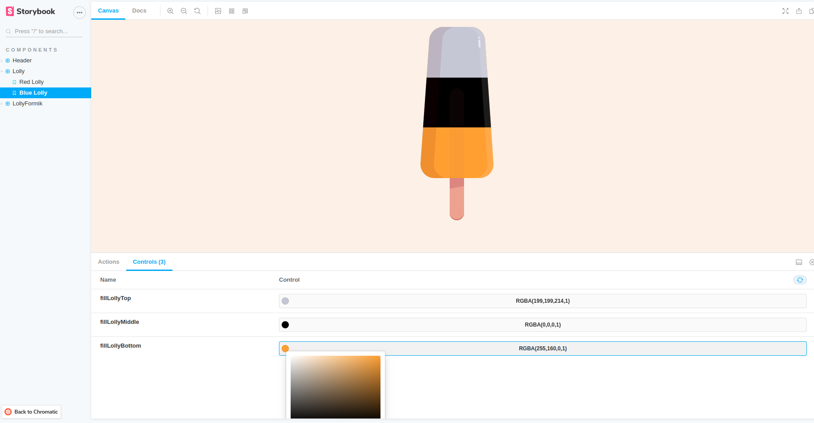
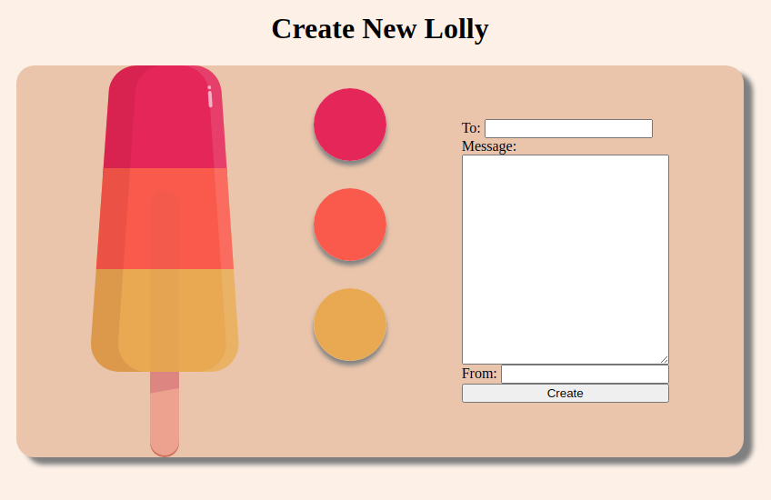
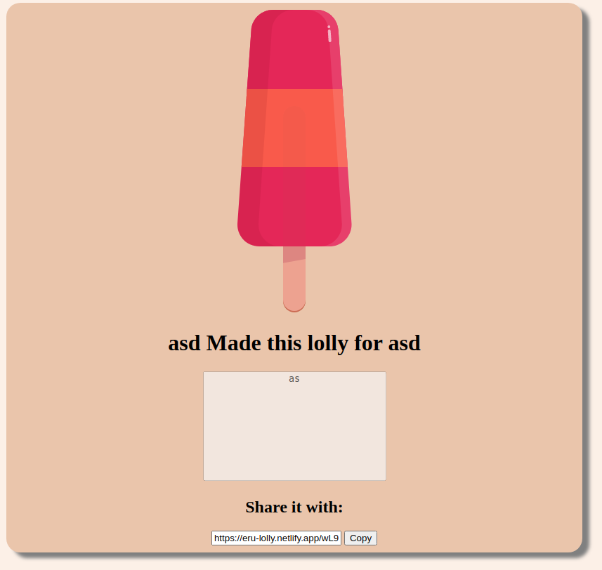

# Project 12E - Virtual Lolly using Gatsby, Netlify, FaunaDB, Formik, and Storybook 6

[Netlify Deployment](https://eru-lolly.netlify.app/)
[View Storybook](https://master--5fa3dfcc4f04710022b3df86.chromatic.com/)

# Storybook

# Demo:
## Main Page:

## Create Lolly:

## Display Lolly:

